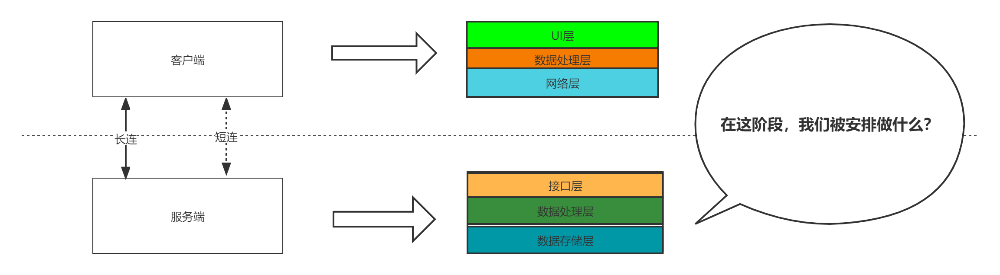
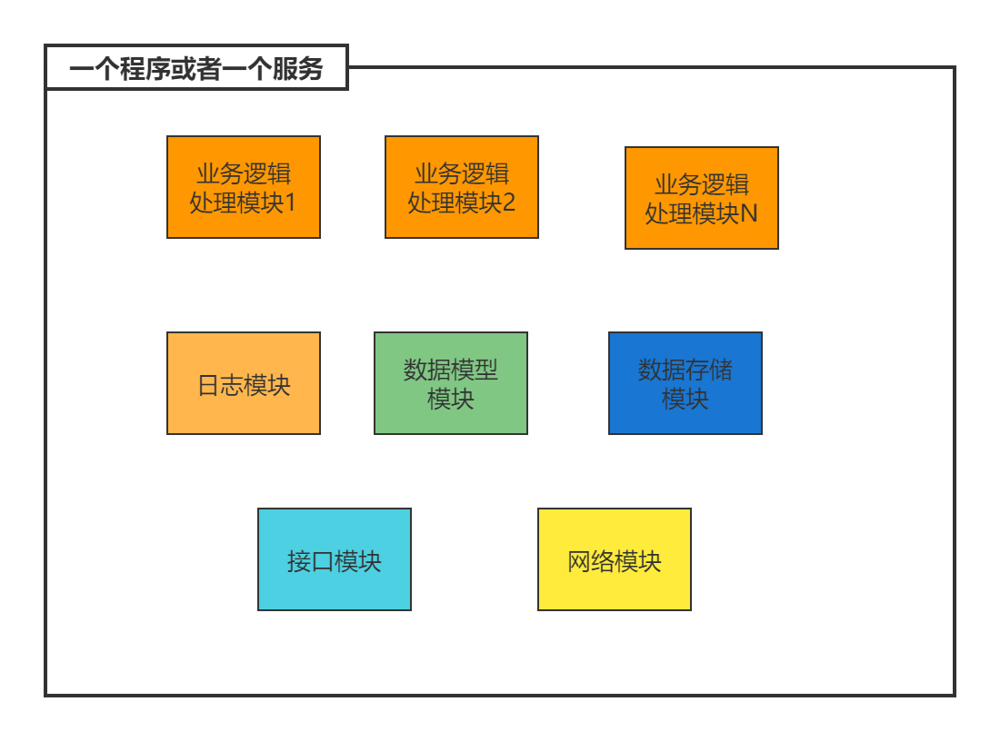
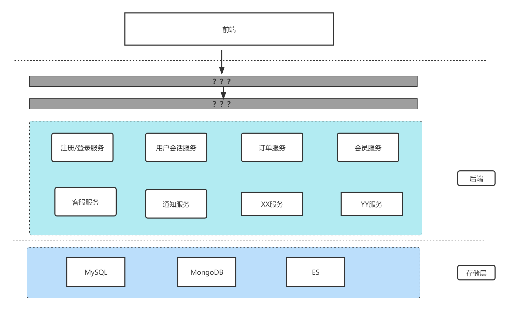
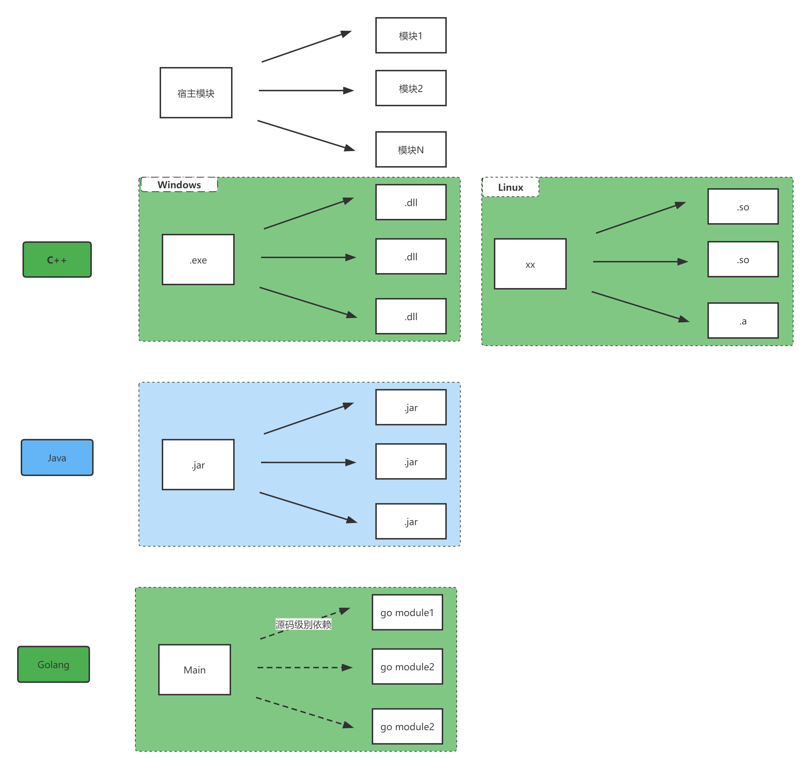
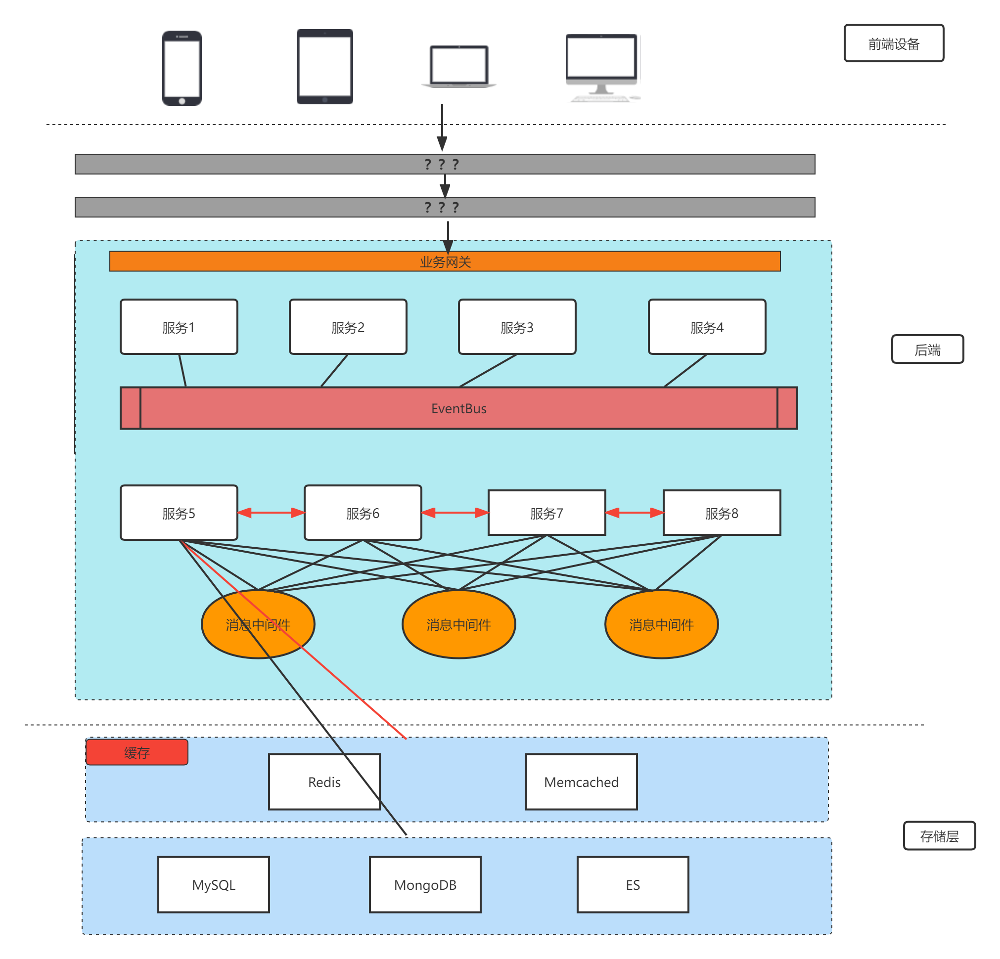
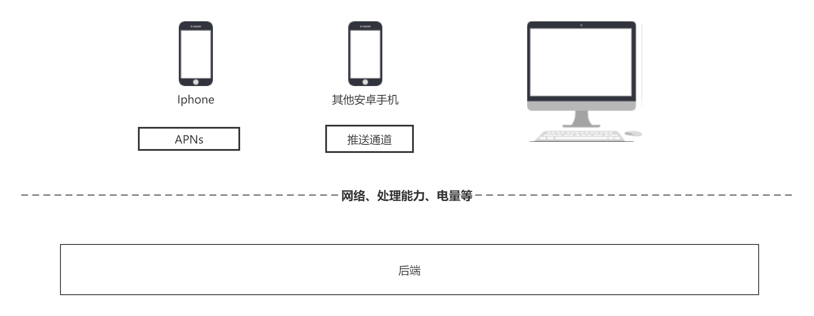
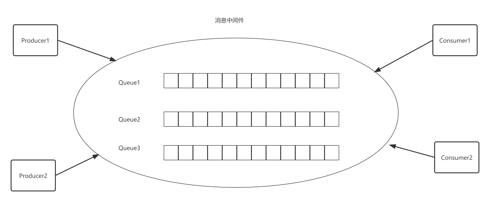
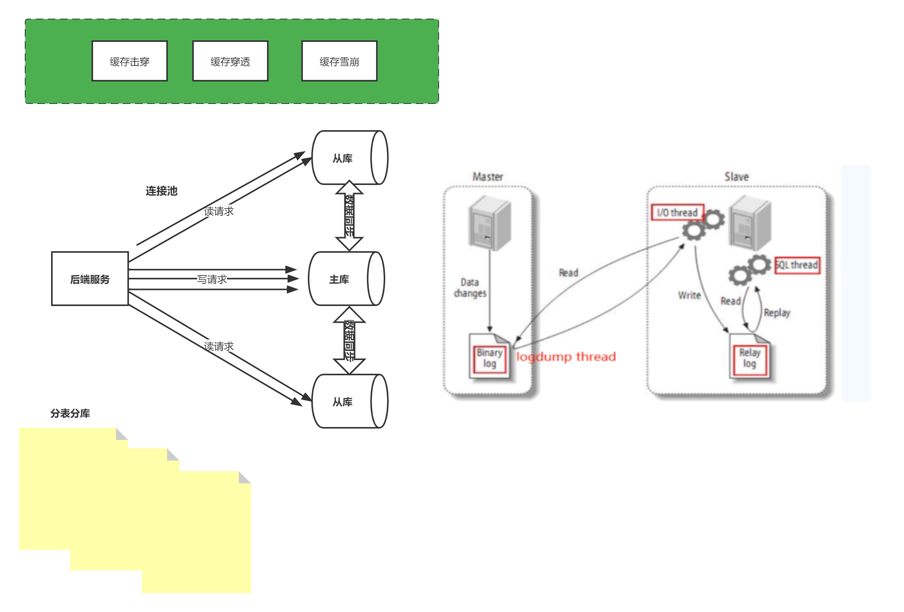
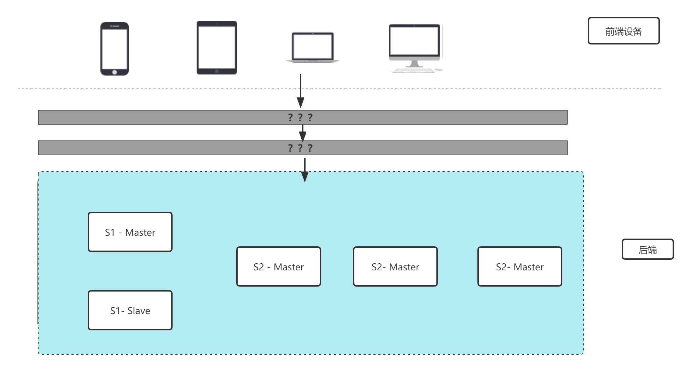
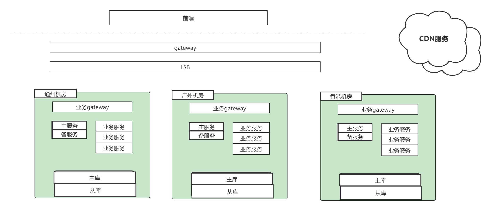

# 工作八年，我是如何构建我的技术知识体系的

加下微信 **easy_coder** 进技术群，加这个微信领奖。

## 阶段 1 —— 在被指导下完成特定业务开发

**在这个阶段，我们被安排做什么？**

1. 在UI Designer工具拖拽设计交互界面；

2. 在回调、handler中增加业务处理逻辑；

3. 在固定创建下增加或者修改对外接口；

4. 新增或者修改数据模型。

**需要具备的能力**

* 熟悉一门编程语言和它的开发环境
* 熟悉基本的库用法和原理（SQL 的增删改查）
* 基本的代码素养（高效的算法、良好的代码风格）
* 了解业务

## 阶段 2 —— 负责独立的模块

**我们需要具备的能力和关注点：**

1. 熟悉业务逻辑；
2. 熟练掌握技术原理（网络模型、协议的编解码、对数据库和 SQL 的性能和调优又进一步了解）
3. 与其他模块的同事的合作和沟通能力

## 阶段 3 —— 负责独立的服务

## 阶段 4 —— 负责整个业务系统

**关注点：**

1. 各个终端的共性差异性（Web端与桌面端、不同移动端的差异）
2. 功能复用、解耦与扩展（业务网关、消息中间件、消息总线EventBus）
3. 服务与服务之间的通信（TCP、HTTP、RPC）
4. 性能问题（设计高可用的策略、引入缓存、数据读写分离）

阶段 4 需要解决部分三高问题（高性能、高并发、高可用）。

## 阶段 5 —— 懂某一个行业

产品 - 技术 - 运营

* 懂业务
* 懂市场

