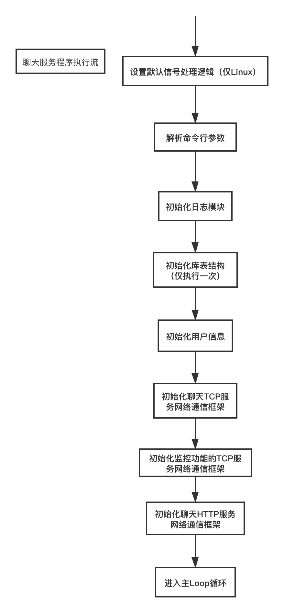

# Flamingo 讲座

## x

```
1. 项目简介：项目整体结构的搭建基于google::protobuf中预留的RPC服务结构service，实现了一个简易的RPC通讯框架。框架中含有客户端和提供远程调用服务的server端，网络通信部分采用的是陈硕的muduo库，并在最后使用cmake进行整体编译构建
2. 项目技术点：
项目共分为3部分，服务端，客户端，服务注册中心
①服务端底层为了保证和客户端网络通信的稳定，采用了开源库muduo，并使用了muduo自带的Poller机制，使得程序可以根据系统情况适应选择select或者epoll的IO复用实现方式
②为了保证服务端和客户端交互的时候数据的传输，采用protobuf进行序列化和反序列化
③使用zookeeper作为服务注册中心，网络服务器的配置信息采用xml格式保存，在服务端启动的时候把服务注册到zookeeper
3.项目后期改进点：
①现在没有加入日志库，导致一旦线上出现问题，必须要调试coredump文件或者去attach 调试，之后准备加入日志库系统
②服务端现在才用的还是单进程单线程，之后准备加入多线程的实现方式
1.项目简介：基于Linux基础API实现http服务器，可以处理静态页面
2.项目技术点：
①服务端采用多线程+epoll io复用的方式，来保证请求的快速并发处理
②对于一些系统API为了保证并发时的可靠性，采用了可重入函数
然后还有一个项目1，我觉得就想删掉了
```


## 一、编译与调试

代码下载地址：

```
https://www.github.com/balloonwj/flamingo
```

编译步骤：

Windows 上直接打开 `FlamingoServer.sln` 即可编译调试。

Linux：

```
cd flamingoserver/
# 生成Makefile文件
cmake .
make -j 4
```

上传下载文件：

```
yum install lrzsz
```

上传

```
rz -y
```

下载：

```
sz filename
```

winscp ftp 

```
add_executable(chatserver ${net_srcs} ${json_srcs}  ${chatserver_srcs} ${mysqlapi_srcs} ${mysqlmgr_srcs} ${zlib_srcs} ${utils_srcs})
#光包含库目录是没用的，还必须使用TARGET_LINK_LIBRARIES链接该库
TARGET_LINK_LIBRARIES(chatserver mysqlclient)
```

安装mysql或者mariadb

```
yum install mariadb-devel
yum install mysql-devel
```

/usr/local/mysql


mysqlclient => libmysqlclient.so

 libmysqlclient.so.12  libmysqlclient.so.13  libmysqlclient.so.15

```
ln -s  libmysqlclient.so.15 libmysqlclient.so
```


ldd 命令查看依赖的库是否正确。


## 二、整体架构


## 三、对外服务端口

###  聊天服务对外端口

| 端口号 | 端口说明          |
| ------ | ----------------- |
| 20000  | TCP 聊天服务端口  |
| 12345  | HTTP 聊天服务端口 |
| 8888   | 监控端口          |


### 文件服务器对外端口

| 端口号 | 端口说明         |
| ------ | ---------------- |
| 20001  | TCP 文件服务端口 |


### 图片服务器对外端口

| 端口号 | 端口说明         |
| ------ | ---------------- |
| 20002  | TCP 图片服务端口 |

监控端口：

```
nc -v 你的ip地址 你的端口号
```

建议大家去学一息：nc、telnet、netstat 等命令。


## 四、通信协议


1111 1111 +  1111 1111 + 1111 1111

  (0)000 0 111 (1)111 1111 (1)111 1111 (1)111 1111


127 1

UTF-8 

leading Byte

协议格式定义于 `chatserversrc/Msg.h` 中：

```
#pragma pack(push, 1)
//协议头
struct chat_msg_header
{
    char     compressflag;     //压缩标志，如果为1，则启用压缩，反之不启用压缩
    int32_t  originsize;       //包体压缩前大小
    int32_t  compresssize;     //包体压缩后大小
    char     reserved[16];
};
#pragma pack(pop)
```


## 五、整型数值的压缩

我们假设现在 **value** 的值是十进制 125678‬，其二进制是 `1 1110 1010 1110 1110`，我们来看一下上述函数执行过程：

 **第一次循环**

十六进制 **0x7F** 的二进制为 `0111 1111`，执行

```
unsigned char c = (unsigned char) (value & 0x7F);
```

后， c = 110（十进制），二进制是 `0110 1110`，接着将 value 右移 7 bit，看看还有没有剩余（与 0 判断），此时 value 变为 981（十进制），对应二进制 `11 1101 0101` ，代码第 **9** 行 if 条件为真，说明一个字节表示不了这个数值，给算出的字节 c 最高位 bit 设置标志值 1（与 0x80 做或运算，0x80 的二进制是 `1000 0000`，代码第 **10 ** 行），得到第一个字节值 238（十进制），对应二进制 `1110 1110`。

**第二次循环**

**c** 开始等于 85（十进制），执行代码第 **7**、**8** 行后，发现 value 的值仍有剩余，再次在该字节的高位设置标志 1，得到第二个字节值 **213**（十进制）。

**第三次循环**

**c** 开始等于 7，执行代码第 **7**、**8** 行后，发现 value 的值已经没有剩余，得到第三个字节值 **7**，然后退出循环。

程序执行过程如下图所示：


## 六、解包流程


## 七、接收和发送缓冲区的设计


## 八、程序初始化流程




## 九、程序整体结构详解 & 业务分层


我的微信：easy_coder

